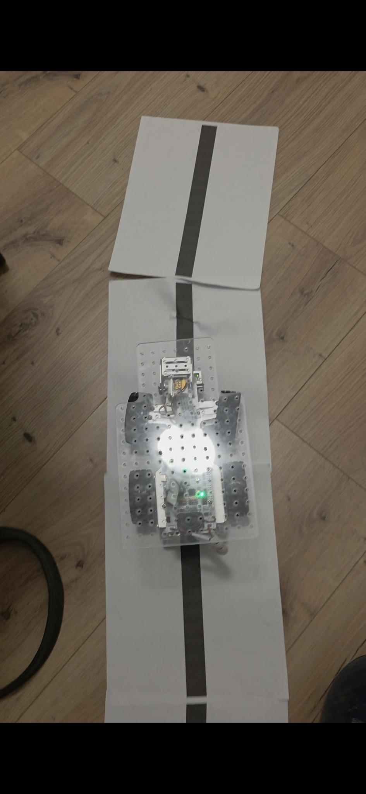

# Daily Logbook Entry Template

## Objectives

- Develop a baseline PID control algorithm for line tracking.

- Calibrate grayscale sensors for high-contrast environments (Black tape on white paper).

- Establish a weighted error calculation method based on three-sensor input.

## Detailed Work Log

### Session 1: Hardware Setup and Calibration (13:30 - 15:30)

**Members Present**: [Rafael Costa]

**Description**: 
Constructed a temporary test track using 4 sheets of white paper with a printed black line to simulate a high-contrast environment. This was used to establish the baseline sensitivity of the TCRT5000 IR sensors on the Picar-X.

**Materials/Tools Used**:
- Picar-X Robot
- White paper
- Python picarx library

**Process/Steps**:
1. Placed sensors over the white background and recorded raw IR reflectivity values.

2. Placed sensors over the black line and recorded the "Low" reflectivity values.

3. Calculated the median "Offset" values to serve as the 0-point for the error function.

**Documentation**:
<!-- Add images, diagrams, screenshots from the images/ folder -->
<!-- Store your images in: images/week-XX/ directory -->



*Figure 1: Initial test platform using segmented paper track for low-speed PID verification.*

### Session 2: Algorithm Design (15:30 - 18:00)

**Members Present**: [Rafael Costa]

**Description**: 
Implemented a weighted "Center of Mass" calculation to determine the line position. Rather than a binary "on/off" status, this method uses the relative intensity of the three sensors to provide a continuous error signal.

## Results & Data

### Measurements/Observations

| Parameter       | White (Baseline) | Black (Line) | Delta (Signal) |
|-----------------|------------------|--------------|----------------|
| Left Sensor     | 1439             | 313          | 1126           |
| Center Sensor   | 1425             | 287          | 1138           |
| Right Sensor    | 1419             | 276          | 1143           |


### Code Snippets

```python
# Weighted error calculation
def get_line_error(raw_values, offsets):
    # Normalize: Signal is high when on the line
    s_l = max(0, offsets[0] - raw_values[0])
    s_m = max(0, offsets[1] - raw_values[1])
    s_r = max(0, offsets[2] - raw_values[2])
    
    total = s_l + s_m + s_r
    if total < 100: return 0.0 # Line lost safety
    
    # Weights: Left = +1, Center = 0, Right = -1
    numerator = (s_l * 1.0) + (s_r * -1.0)
    return (numerator / total) * 100
```

### Calculations

Show your mathematical work:

### Calculations

The error (e) is calculated as a weighted normalized average:

$$
e = \frac{\sum (w_i \cdot s_i)}{\sum s_i} \times 100
$$

where

$$
w = [1,\ 0,\ -1]
$$

corresponds to the [Left, Center, Right] sensors.

## Challenges & Solutions

### Challenge 1: Inconsistent Environmental Lighting

**Problem**: 
The IR sensors were picking up ambient light from windows, causing the "straight" car to drift right because the right sensor saw a "darker" background.

**Debugging Steps**:
1. Printed raw values in a loop while moving the car.

2. Observed the Right sensor baseline was ~20 units lower than the Left.

**Solution**: 
Implemented unique OFFSET_L/M/R variables instead of a single global threshold to normalize the hardware variances.

## Next Steps

- [x] Migrate to a real track (Blue tape on Black).

- [ ] Model system dynamics in MATLAB.

---

**Entry completed**: 2026-02-03 18:30