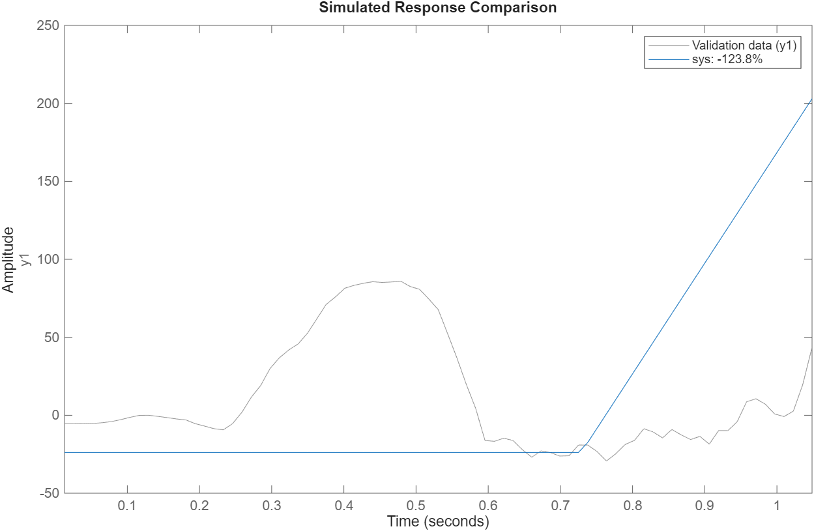
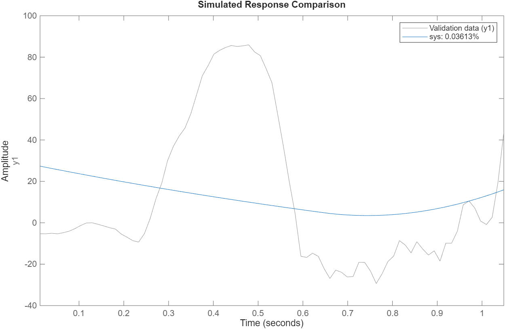
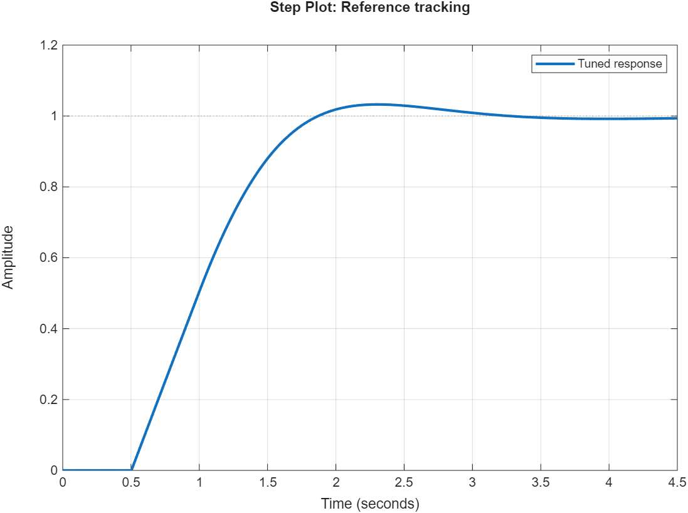
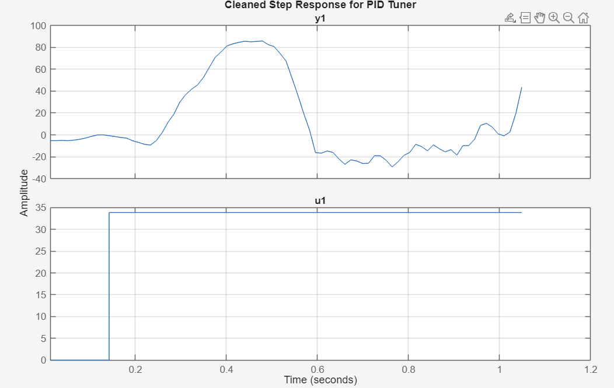

## Objectives

- Perform System Identification for the Picar-X steering plant.

- Use MATLAB PID Tuner to solve for optimal Kp​ and Kd​ gains.

- Coordinate with Perception leads on logic for handling track intersections.

## Detailed Work Log

### Session 1: Data Collection & MATLAB Modeling (14:30 - 17:00)

**Members Present**: [Rafael Costa]

**Description**: 
Developed a Step Response script to capture the car's physical behavior. The car was driven at a constant velocity (v=40) while the steering was commanded from a centered position (-13.9°) to a 20° step. The resulting CSV was imported into MATLAB.

**Materials/Tools Used**:
- MATLAB System Identification Toolbox
- iddata and procest functions

**Process/Steps**:
1. Recorded Time, Input (u), and Output (y) data to CSV.
2. Trimmed "Crash data" and pre-step noise in MATLAB.
3. Identified the plant as a 'P1DI' model (Proportional, 1 pole, Delay, Integrator).

**Documentation**:
<!-- Add images, diagrams, screenshots from the images/ folder -->
<!-- Store your images in: images/week-XX/ directory -->

*Figure 1: Simulated Response Comparison System 1*

*Figure 2: Simulated Response Comparison System 2*

*Figure 3: PID Tuner Tuned Response*

*Figure 4: Cleaned Step Response*

### Session 2: Perception Alignment (17:00 - 18:00)

**Members Present**: [Rafael Costa, Ishaan Grewal, Nolan Su-Hackett]

**Description**:
Met with Nolan and Ishaan to discuss the "Branching Path" problem. The grayscale sensors are currently latching onto white track boundaries or conflicting lines at intersections.
## Results & Data

### Measurements/Observations

| Parameter          | Value | Notes                                           |
|--------------------|-------|-------------------------------------------------|
| Model Delay (Td)   | 0.11 s| Mechanical lag of servo/inertia                 |
| Plant Gain (Kp)    | 20.9  | High sensitivity to steering inputs             |
| Tuned Kp           | 0.45  | Scaled for real-world stability                 |
| Tuned Kd           | 0.03  | Used to dampen 0.11 s dead-time oscillation      |

### Calculations

Based on the MATLAB `idproc` result, the transfer function for the plant G(s) is:
$$
G(s) = \frac{20.9}{s} \, e^{-0.11 s}
$$

This represents an integrating process with a pure time delay of 110 ms.

## Challenges & Solutions

### Challenge 1: Modeling Errors in MATLAB

**Problem**: Initial tfest results gave a Kp​ of 2.1, which caused violent oscillation.

**Debugging Steps**:
1. Observed that steering is an integrating process (angle → lateral velocity).

2. Re-ran identification using procest(data, 'P1DI').

**Solution**: The new model accurately reflected the 0.11s delay, leading to much more conservative and stable gains.

## Next Steps

- [ ] Implement "Turning Priority" logic: Bias sensor weights during known turn entries.

- [ ] Integrate Camera Feed-Forward term to anticipate curves before sensors reach them.

---

**Entry completed**: YYYY-MM-DD HH:MM