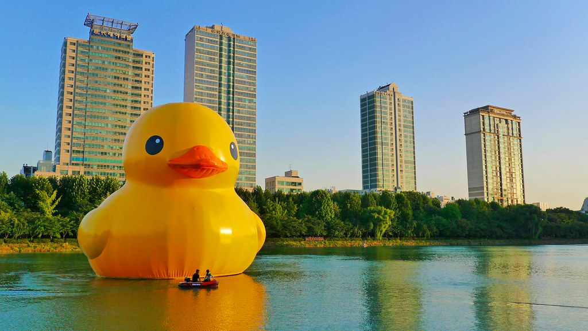

# Daily Logbook Entry Template

## Objectives

What did you plan to accomplish in this session?

- Clean up filtering of CTE for Turns
- Create cuts on turn masks to allow better curve fitting 
- Design y_reference points at which CTE offset values in meters will be returned for PID Loop

## Detailed Work Log

### Session 1: [CTE Cleanup, PolyFit Cuts] (12:00 - 15:00)

**Members Present**: [Nolan Su-Hackett]

**Description**: 
Reviewed previously written turn masking code, and added some changes that should clean it up and allow tighter and more accurate fitting. Changes will be described in relation to code changes below

```python
#Old Masking Code: V1

            # right side of the lane (mirror = take x >= lane_center_x)
            # mask_turn[
            #     max(intersection_y - roi_half_width, 0): min(intersection_y + roi_half_width, height),
            #     lane_center_x:
            # ] = 255

            #Newer Code Tighter Filtering V2
            y0 = intersection_y
            y1 = min(intersection_y + int(2.5 * roi_half_width), height)
            mask_turn[y0: y1, l:] = 255

```
Changes:
1. Intersection_y is the highest row at which an intersection is detected, this would be the highest row of the green cross that would appear in the BEV transform. Previously the code took tolerance above this point however this is not necessary as it should already be the upper bound, intersection_y will now be the new upper bound on y.
2. Previously the lower bound takes a distance which is half a tape width below the highest detected intersection point, this means that the bottom half rows of the turn pixels can be cut out, this is changed in V2, by allowed 1.25* a full tape width below the highest detected intersection point.
3. Previously the x bound filtered everything on the other side of the lane center (dependent on case (left or right)), however this can cut off half of the straight section of the tape. Instead of the center V2 uses the left or right, which are defined as the left or right bounds of the centered green tape.

**Materials/Tools Used**:
-
-

**Process/Steps**:
1.
2.
3.

**Documentation**:
<!-- Add images, diagrams, screenshots from the images/ folder -->
<!-- Store your images in: images/week-XX/ directory -->



*Figure 1: Brief description of what the image shows and its relevance to your work*

### Session 2: [Activity Name] (HH:MM - HH:MM)

**Members Present**: [Name1, Name2, Name3]

**Description**:

## Results & Data

### Measurements/Observations

| Parameter | Expected | Measured | Pass/Fail | Notes |
|-----------|----------|----------|-----------|-------|
| | | | | |

### Code Snippets

```python
# Add relevant code here
```

### Calculations

Show your mathematical work:

$$
x = \frac{-b \pm \sqrt{b^2 - 4ac}}{2a}
$$

## Challenges & Solutions

### Challenge 1: [Issue Description]

**Problem**: 

**Debugging Steps**:
1.
2.
3.

**Solution**: 

**Lessons Learned**: 

## Next Steps

- [ ] Task 1
- [ ] Task 2
- [ ] Task 3

## References

- [Reference 1](URL)
- [Reference 2](URL)

## Personal Notes

Any additional thoughts, observations, or things to remember...

---

**Entry completed**: YYYY-MM-DD HH:MM
