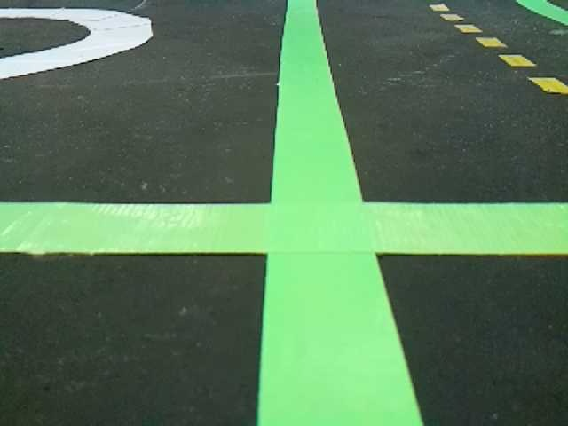
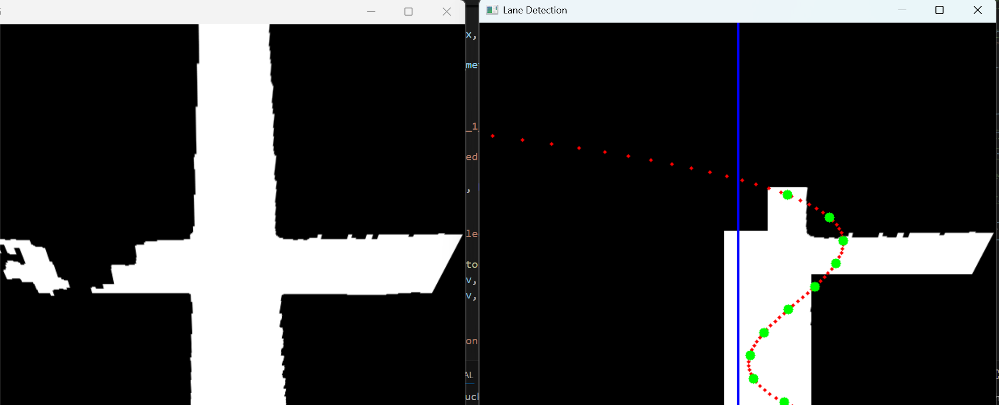
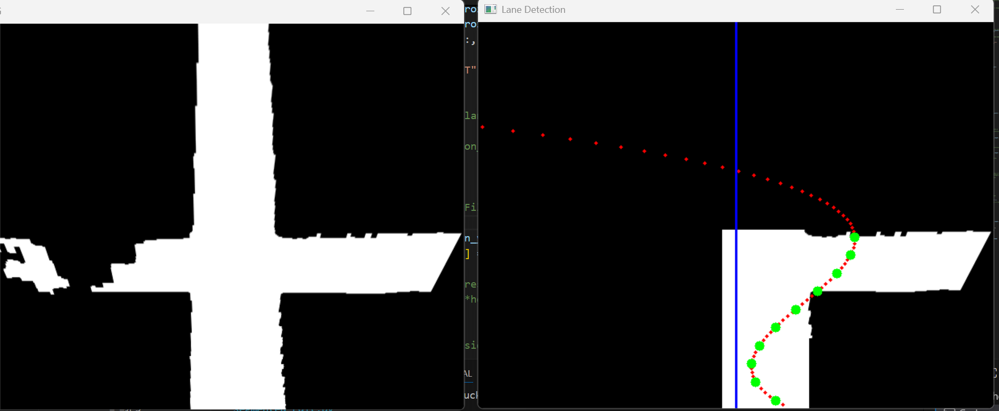
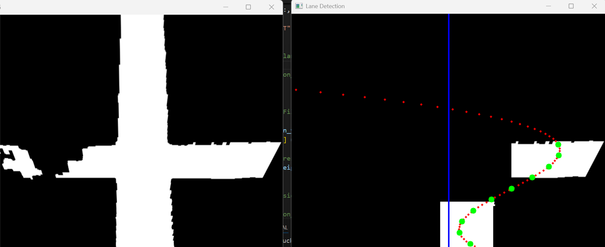

# Daily Logbook Entry Template

## Objectives

What did you plan to accomplish in this session?

- Clean up filtering of CTE for Turns
- Create cuts on turn masks to allow better curve fitting 
- Design y_reference points at which CTE offset values in meters will be returned for PID Loop

## Detailed Work Log

### Session 1: [CTE Cleanup, PolyFit Cuts] (12:00 - 15:00)

**Members Present**: [Nolan Su-Hackett]

**Description**: 
Reviewed previously written turn masking code, and added some changes that should clean it up and allow tighter and more accurate fitting. Changes will be described in relation to code changes below

```python
#Old Masking Code: V1

            # right side of the lane (mirror = take x >= lane_center_x)
            # mask_turn[
            #     max(intersection_y - roi_half_width, 0): min(intersection_y + roi_half_width, height),
            #     lane_center_x:
            # ] = 255

            #Newer Code Tighter Filtering V2
            y0 = intersection_y
            y1 = min(intersection_y + int(2.5 * roi_half_width), height)
            mask_turn[y0: y1, l:] = 255

```
Changes:
1. Intersection_y is the highest row at which an intersection is detected, this would be the highest row of the green cross that would appear in the BEV transform. Previously the code took tolerance above this point however this is not necessary as it should already be the upper bound, intersection_y will now be the new upper bound on y.
2. Previously the lower bound takes a distance which is half a tape width below the highest detected intersection point, this means that the bottom half rows of the turn pixels can be cut out, this is changed in V2, by allowed 1.25* a full tape width below the highest detected intersection point.
3. Previously the x bound filtered everything on the other side of the lane center (dependent on case (left or right)), however this can cut off half of the straight section of the tape. Instead of the center V2 uses the left or right, which are defined as the left or right bounds of the centered green tape.

PolyFit Cuts:

```python
mask_turn[:int(0.8*height), :int(0.7*width) ] = 0
mask_turn[:int(0.8*height), int(0.2*width):] = 0
```

Line 1: cuts a rectangle out off the Turn_BEV, this is so that the polynomial does not need to fit to a large proportion of pixels that create the shape of a 90-degree turn. This was done so that the polunomial curve will fit a more natural turn path, the images can be seen in the documentation section

**Materials/Tools Used**:
- Python
**Process/Steps**:
1. Read previously written code
2. Identify possible optimizations
3. devise a way for the polynomial to fit a more natural turning path.

**Documentation**:

Figure 1: Reference Image

Figure 2: Original BEV and Transformed BEV before the work on the cleanup

Figure 3: Original BEV and Transformed BEV after the cleanup was done

Figure 4: After creating the rectangular cut to the TURN BEV for the polyfit


### Session 2: [Creating Y_references] (15:00 - 16:00)

**Members Present**: [Nolan Su-Hackett]

**Description**:
Creating y_reference points at which CTE offsets will be returned from the center line. Following discussion with Rafael (Control Lead) it was decided that 10 points should be sufficient for PID calculations. y_refs are bounded from the bottom of the image up until the highest white pixel that was masked by the respective turn mask. The x values were calculated using the generated polynomial.

## Results & Data
Sample Output for the reference image provided above, these are the green points in figure 4.
y_refs: [470, 447, 424, 402, 379, 357, 334, 312, 289, 267]
cte_px: [44.25, 22.42, 27.37, 50.67, 87.68, 128.78, 170.92, 204.05, 224.41, 223.83]
cte_m : [0.0205, 0.0104, 0.0127, 0.0235, 0.0406, 0.0596, 0.0791, 0.0945, 0.1039, 0.1036]

### Code Snippets

```python
# -------------------- compute 10 CTE values at 10 y_ref points --------------------
    y_min = int(np.min(ys))  # top-most detected lane pixel (smallest y)
    y_max = int(np.max(ys))  # bottom-most detected lane pixel (largest y)

    margin = int(0.02 * height)  # avoid endpoints (noise/sparsity)

    # average = (y_min + y_max) / 10
    # y_top = 
    y_top = min(max(y_min + margin, 0), height - 1)
    y_bottom = min(max(y_max - margin, 0), height - 1)

    if y_bottom <= y_top:
        return None, None, None, None, None

    y_refs = np.linspace(y_bottom, y_top, 10).astype(int)

    car_center_x = width // 2
    cte_pixels_list = []
    cte_meters_list = []
    lane_x_list = []

    # meters-per-pixel selection (replace with per-state if needed)
    mpp = meters_per_pixel_straight

    for y_ref in y_refs:
        lane_x = a * (y_ref ** 3) + b * (y_ref ** 2) + c * y_ref + d

        # sign convention: positive means lane is to the RIGHT of car center
        cte_px = float(lane_x) - float(car_center_x)
        cte_m = cte_px * mpp

        cte_pixels_list.append(cte_px)
        cte_meters_list.append(cte_m)
        lane_x_list.append(lane_x)
```
## Challenges & Solutions

### Challenge 1: [Poly Fitting]

**Problem**: 
Finding a wa to make the polynomial fit properly
**Debugging Steps**:
1. trying different cuts of the Turn_BEV

**Solution**: 
80% height and 70% width ratio was determined to be best


## Next Steps

- [ ] Test with live feed on actual lanes rather than just images.

---

**Entry completed**: 2026-03-06 17:00
