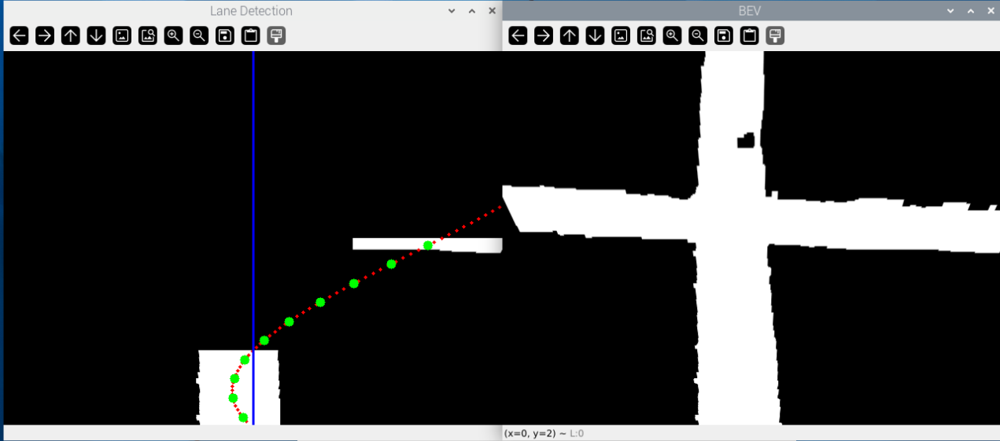
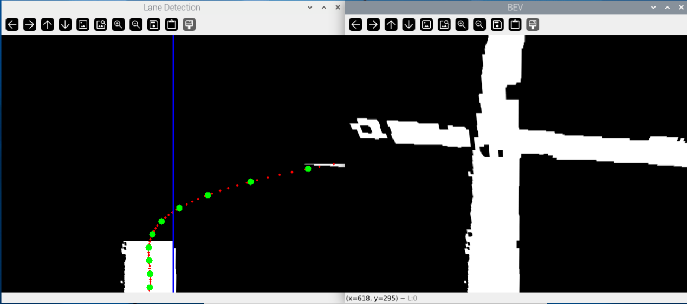

## Daily Summary

This session focused on subsystem integration between Control and Perception using ZeroMQ and camera-guided turn logic. Rafael implemented mission-state publishing and CTE reception, iterated through a temporary ZMQ disable/enable cycle for testing, introduced camera-guided turn handling, and then refactored the approach to a Pure Pursuit style controller with adaptive lookahead. Follow-up commits on Mar 6 simplified trajectory handling in perception modules and added more run logs from testing. Perception focused mainly on testing the new object detection model aswell as the revised CTE code using the live camera on the car.

---

## Entry - Rafael Costa

**Time:** 15:00-18:00 (team session), Mar 6 follow-up commits  
**Activity Type:** Implementation, Integration, Refactoring, Testing  
**Status:** Completed  
**Estimated Effort:** 3.0 h  

### Work Performed

- Implemented ZMQ mission-state publishing and telemetry support in control flow, including camera CTE reception/handling.
- Temporarily commented out ZMQ server calls in `control/main.py` for controlled testing, then restored and advanced the integration path.
- Added camera-guided turn behavior with trajectory handling.
- Refactored turn implementation to use Pure Pursuit concepts with adaptive lookahead; added `control/server.py` and calibration support (`control/calibration.py`).
- Simplified perception-side trajectory communication by removing unnecessary trajectory handling and keeping CTE communication cleaner.
- Added additional run logs after integration tests.

### Decisions

- Use a server-based integration path (ZMQ) with explicit mission-state publishing to decouple subsystem timing.
- Favor a Pure Pursuit-style turn strategy with adaptive lookahead over previous turn handling for smoother camera-guided maneuvers.
- Reduce perception-side message complexity by simplifying trajectory payload handling when not required.

### Issues Encountered

- Integration complexity required temporary rollback/commenting of server calls during test passes.
- Early trajectory messaging added overhead and ambiguity between control/perception ownership, requiring simplification.

### Next Steps

- [ ] Validate camera-guided turns across more intersection cases.
- [ ] Tune adaptive lookahead and calibration values with on-track data.
- [ ] Lock the final ZMQ contract before full team integration testing.

### References (commits from Mar 5 + Mar 6)

- `702c6ce` - Implement ZMQ server functionality and camera CTE handling
- `c3dde23` - Temporarily disable ZMQ calls in `main.py` for testing
- `38605eb` - Add camera-guided turn with trajectory + ZMQ integration
- `2d4294c` - Refactor to Pure Pursuit + adaptive lookahead, add server/calibration
- `22505d7` - Simplify trajectory handling in perception modules
- `458bc3c` - Add run logs from testing
- `502d6ab` - Additional refactor/log updates

### Reflection

This was a high-impact integration session. Rapid iteration between implementation and controlled rollback allowed risky communication changes to be validated in smaller steps. By the end of the window, the architecture moved toward a cleaner contract boundary and a more robust turn-generation method.

---

## Entry - Ishaan Grewal

**Time:** 15:00-16:30  
**Activity Type:** Implementation, Testing, Team Sync  
**Status:** Completed, In Progress  
**Estimated Effort:** 1.5  

### Work Performed & Testing Results

- **Object Detection Model - Implementation & Testing:** Tested the retained object detection model with Nolan. The major revision to this model's dataset was the addition of 60 new images for the Duck class, since the previous model failed to detect the class altogether.
- **CTE Turn Implementation - Perception Team Sync:** Went over the new code that Nolan wrote to finish the CTE implementation for right and left turns. Modified/optimized the lane filtering to improve the polynomial fit (which was also changed to a third degree to better fit the turning curve).
- **CTE Turn Implementation - Track Testing:** Nolan and I tested the new CTE (`lane_detection_and_cte.py`) for right and left turns via the live camera feed. Testing was conducted at intersections with stop signs, in which the grayscale sensor was positioned at different locations on the stop line to represent different detection scenarios. For example, CTE was observed at the front of the stop line (furthest away from the intersection), the middle of the stop line, and the end of the stop line (closest to the intersection). These three cases represented the worst, middle, and best case scenarios for where the car would stop, respectively. In addition to stop intersections, the CTE for turns was also tested at normal right and left turns. All testing images can be found [Here](https://github.com/ELEC-392/elec-392-project-duclair_2/tree/main/images/week-08/Perception_CTE_Testing) 

As expected, the CTE performed better closer to the intersection (at the end of the stop line) since the image is clearer and the source points trapezoid better captures the lanes of interest. The image below (on the left) showcases the lane detection for a left turn at the end of the stop line, with the curve fit (red dotted curve) and y_ref points (green). The image (on the right) also shows the original BEV transform before filtering and curve fitting.

That being said, even in the worst case where the car stops at the front of the stop line (furtherest from the intersection), the curve fitting and CTE calculations still work as illustrated below for a left turn.

### Issues Encountered

- **Object Detection Model:** Despite adding 60 new images to the model's dataset, it still fails to detect the Duck class. The team is unsure about what could be causing this issue and will discuss with Professor Paulo Araujo in the next studio/lab section.

### Next Steps

- [ ] Modify `perception_server_comms.py` to include a means of sending object detections (and their distances) to the server.
- [ ] Modify `perception_server_comms.py` to send the newly formatted CTE for turns (list of CTEs at various y_ref locations)
- [ ] Discuss issues with the Duck class with Professor Paulo Araujo to finalize the object detection model once tested.
- [ ] Test real-time perception integration with the server.
- [ ] Test CTE for turns live and fully integrated with the PID control loop.

### Reflection

This work session reinforced the importance of iterative testing and collaboration when integrating perception algorithms with other subsystems. Through testing the updated CTE implementation for turns, I learned how sensitive lane detection and curve fitting are to the vehicle's stopping position relative to the intersection. Adjusting the lane filtering and switching to a third-degree polynomial improved the curve approximation, and testing across multiple stop-line positions helped validate that the CTE calculations remain usable even in less ideal conditions. This highlighted the value of testing algorithms across realistic edge cases rather than only ideal scenarios. The object detection model's continued inability to detect the Duck class, even after adding new training images, reveals a serious issue that needs to be addressed immediately, since this is a critical class to detect for safety considerations. That being said, with the CTE working, the Perception team is in a good spot relative to team timelines and has enough time to test and improve the CTE by testing it fully integrated with the PID loop. Moving forward, I will be focusing on designing perception outputs to better support downstream integration with the control system and server communications. Furthermore, future work will involve lots of hands-on testing with Rafael to ensure both systems integrate effectively and that Perception is providing the right inputs at the right time.

---

## Entry - Nolan Su-Hackett

**Time:** 15:00-16:30 
**Activity Type:** Testing, Team Sync  
**Status:** Completed  
**Estimated Effort:** 1.5 h  

### Work Performed

- Tested CTE with improved polyfit and the 10 y_ref points using live feed.
- Testing was done at the boundaries of stop lines, one test would occur at the front of the stopline (furthest away from the intersection, and one at the end of the stopline (closest to the intersection). CTE performed better closer to the intersection as the image is clearer and the trapezoid captures more of it, but still works adequately at our worst case distance. Images of the testing outputs can be seen in Ishaans Section.
- Discussed with Rafael whether he would prefer the polynomial coefficients or the 10 y_ref CTE offsets that are currently being calculated.
- Tested object detection model with extra duck images

### Issues Encountered

- Ducks are still not detected by the model even after increasing the number of images

### Next Steps

- [ ] Discuss at next studio with a professor on improvements that can be made to detect the duck class.

### Reflection

With CTE working the Perception team is in a good spot relative to the demo date, the remaining issue seems to be the detection of the duck class. All the other classes are consistently being detected. One aspect that is slightly worrisome is that while the perception team was running the detect_objects python file which now includes the CTE code it was discovered that there is some startup delay before the CTE output appears. After the startup delay there isnt much issue with the execution of the program but this needs to be tested with other functionalities to ensure that the load is not too much for the Pi.

---

## Entry - Declan Smith

**Time:** [Add time]  
**Activity Type:** [Add activity type]  
**Status:** [Add status]  
**Estimated Effort:** [Add hours]  

### Work Performed

- [To be added by Declan]

### Decisions

- [To be added by Declan]

### Issues Encountered

- [To be added by Declan]

### Next Steps

- [ ] [To be added by Declan]

### Reflection

[To be added by Declan]

---

## Team Metrics

| Member | Hours | Status | Key Contribution |
|--------|-------|--------|------------------|
| Rafael Costa | 3.0 h | ✅ | ZMQ integration, camera-guided turns, Pure Pursuit refactor, telemetry logs |
| Ishaan Grewal | 1.5 h | ✅/⚠️ | Object Detection Model (⚠️), CTE Turn Implementation (✅), Team Sync (✅) |
| Nolan Su-Hackett | 1.5h | ✅] | Testing, Team Sync |
| Declan Smith | [Add] | [Add] | [To be added] |

---

**Entry completed**: 2026-03-07
